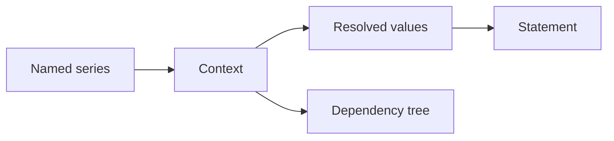

`orcaset` builds financial statement models in Python. Line items are named series over time, dependencies are explicit, and a single `Context` resolves a run so you can print a statement or inspect how a value was computed.

<CardGroup cols={2}>
  <Card title="Installation" href="/installation" icon="download">
    Add orcaset to a Python 3.14+ project with uv or pip.
  </Card>
  <Card title="Quickstart" href="/quickstart" icon="rocket">
    Build a three-line revenue, cost, and profit model.
  </Card>
</CardGroup>

:::warning[Experimental]
The public API is still in flux (`0.x`). These pages stay short on purpose: enough to install the library and run a first model, without documenting surfaces that are likely to change.
:::

## What it is for

Orcaset is aimed at models that need to be **written, checked, and reused as code** — operating forecasts, three-statement models, valuation schedules — including models written by agents.

A typical model looks like this:

- **Series** are named line items over periods (or dates).
- **Dependencies** come from `get_at(...)`, not spreadsheet addresses.
- **Context** holds one run: memoized values you can query and inspect.
- **Statements** format those values as a table.

## These docs

This first pass has three pages. More guides and API reference can land later, once the surface settles.

<CardGroup cols={2}>
  <Card title="Install" href="/installation" icon="package">
    Requirements and package install.
  </Card>
  <Card title="Build a model" href="/quickstart" icon="play">
    A complete, runnable first example.
  </Card>
</CardGroup>

For more patterns in the meantime, see the [examples](https://github.com/Orcaset/orcaset-py/tree/main/examples) in the repository.
