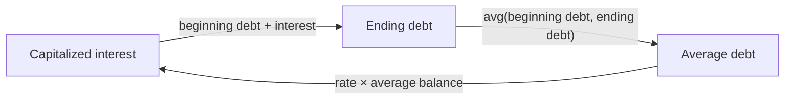

# Iterative Solver

This example demonstrates orcaset's iterative solver for a genuine circular formula: capitalized interest depends on average debt over the period, while ending debt equals the sum of the starting debt balance plus accrued interest.



## How It Works

For each month, ending `debt` equals beginning debt plus `interest`. Interest is the monthly rate multiplied by the average of beginning and ending debt.

The `interest` definition cuts the cycle on its ending debt balance lookup:

```py
end = yield from get_at(debt, period.end, seed=0.0, distance=maybe_abs_distance)
```

`seed` provides the first guess and `distance` measures the residual between successive guesses. `Context` iterates until every seeded cell in the cycle is within its tolerance. Both arguments are typed against the fetched value, so an invalid seed type is caught by a static type checker. In this example, `debt` returns `Maybe[float]` which is compatible with both the seed value and distance function. Note that `maybe_abs_distance` returns `float("inf")` if the value flips between a `float` and `Na`.

Confirm the first period is solved correctly:

```txt
  Starting debt  100.00
  Ending debt    110.53
Avg debt         105.27

  Interest rate       10%
× Avg debt         105.27
Accrued interest    10.53

Starting debt (100) + Interest (10.53) = Avg debt (105.27)
```

## Run

From the repository root:

```sh
uv run python examples/iterative-solver/main.py
```

Script output:

```txt
Start                 2025-12-31  2026-01-31  2026-02-28  2026-03-31
End       2025-12-31  2026-01-31  2026-02-28  2026-03-31  2026-04-30
Debt          100.00      110.53      122.16      135.02      149.23
Interest                   10.53       11.63       12.86       14.21
```