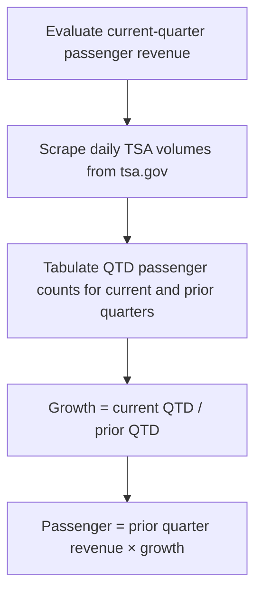

# Web scraping

This example inlines a live web scrape into an orcaset model. It scrapes the daily [TSA checkpoint travel numbers](https://www.tsa.gov/travel/passenger-volumes) to build the current quarter's estimate of passenger revenue for Southwest Airlines (LUV).

It is a standalone uv project so scraping libraries stay out of the orcaset package. orcaset is pinned to `0.8.0` and resolved from the repo checkout.

## Model Structure

Southwest reports revenue in three segments: passenger, freight, and other. This builds a revenue model with the following structure:

* **Passenger:** Current quarter estimated using QTD change in checkpoint volume to the prior quarter (`(current QTD / prior QTD) * total prior quarter`). Constant thereafter.
* **Freight:** Held constant at last quarterly value.
* **Other:** Held constant at last quarterly value.

This revenue model is meant to highlight inline data retrieval and manipulation from an outside data source. It is purposefully simple.

## Data Scraping

The scrape is not a pre-step. The model fetches data on-demand from `tsa.gov` whenever a cell is evaluated that depends on TSA volume. Values are cached within a `Context`, so re-evaluating values with an existing `Context` will not trigger the scraping again.



The model embeds the data retrieval, extraction, and aggregation directly into the cell values. New values are automatically incorporated into the model as they become available; no copy-paste required.

The scraping process uses well-known libraries from Python's open ecosystem. They are robust, actively maintained, and come for free by simply using Python.

* **requests:** Simple, synchronous http client used to retrieve the webpage from tsa.gov. Maintained by the Python Software Foundation.
* **beautifulsoup4:** HTML parsing library that finds and extracts data from the webpage.  Mature library with over twenty years of development.

The data retrieval process in this example is basic and meant to highlight how `orcaset` can integrate with arbitrary third-party systems.

## Run

Requires Python 3.14+ and a network path to `tsa.gov`.

```sh
cd examples/web-scraping
uv run python main.py
```

The run prints the TSA QTD factor, then a fixed-width table of quarterly TSA checkpoint volume and operating revenue from Q1 2026 through Q4 of the next calendar year (Southwest's fiscal year is the calendar year). Current-quarter TSA is quarter-to-date.

## Layout

| File | Role |
| --- | --- |
| [`scrape.py`](scrape.py) | Download and parse the TSA table; expose `tsa_passengers` as a daily `PeriodSeries` |
| [`data/luv_operating_revenue.csv`](data/luv_operating_revenue.csv) | Reported quarterly revenue ($ millions), loaded at runtime |
| [`model.py`](model.py) | History, current-quarter passenger estimate, held freight/other, and `Stmt` layout |
| [`main.py`](main.py) | Reporting dates, evaluate in a `Context`, and print the table |
